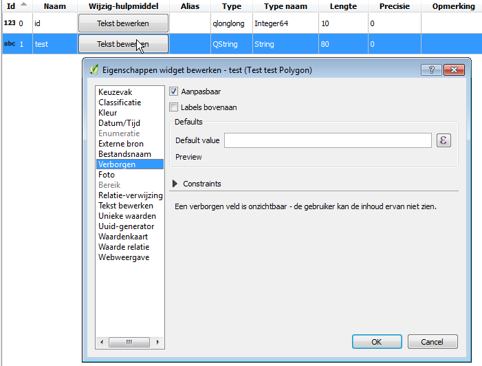

Omgevings analyse tool - rapporteertool voor milieuvergunningen
===============================================================
*English see below*

Op vraag van LNE werd een tool ontwikeld een omgevingsrapport van locatie maakt. 

Ten opzichte van de verschillende vector lagen, die ingeladen zijn in het project (WFS of vectorlaag) 
wordt een soort rapport gegenereerd wordt voor een specifieke locatie:

De gebruiker kan een locatie op de kaart aanklikken of een lijn of polygoon intekenen. 

De gebruiker kan ook een vectorlaag gebruiken als input, 
dan wordt er voor elke feature een appart rapport weggeschreven naar een output folder.  

De volgende informatie wordt weergegeven:

- Welke afstand de geslecteerde locatie tot de dichtsbijgelegen objecten van de verschillende vectorlagen gelegen zijn.
- Toon de attributen van dichstbijgelegen features
- Knop bekijk op kaart /zoon naar in rapport
- De gevonden objecten kunnen worden geselecteerd als je "Selecteer de gevonden features" aanvinkt, zodat ze op de kaart in de attribuuttabel terug te vinden zijn.
- Export van rapport naar een document dat in MS Word kan geopend worden.
- De ingestelde parameters per laag worden samen met et project opgeslagen en zijn dus opnieuw beschikbaar nadat het project werd afgesloten.  

Werking
-------
De rapporteertool is ontwikkelt als een QGIS plugin, de configuratie is een gewoon QGIS-project. 
De instellingen worden mee opgeslagen in een het QGIS-project (.qgs) zodat je deze niet staads opnieuw moet instellen.

Velden verbergen in het resultaat kan door de het "Wijzighulpmiddel" op verborgen te zetten:

- Rechtsklik op laag, kies eigensschappen
- In het tabblad eigenschappen: Klik op de knop onder wijzighulpmiddel, default staat hier "Tekst bewerken", zet dit op "Verborgen". 

Het invoer formulier uit:

Dit resulteerd in een volgende rapport, dat je kan opslaan als word of html-document:

Environmental analysis tool - report tool for environmental permits
===================================================================

At the request of LNE a tool has been developed and create an environment report location.

With respect to the various vector layers, which are loaded into the project (WFS vector or low)
for a specific location a kind of report is generated:

The user can click a location on the map or a line or polygon subscribe.

The user can also use a vector as an input layer,
one appart report is for each feature is written to an output directory.

The following information is displayed:

- What distance the selected one location to the nearest objects of different vector layers are located.
- View the attributes of features dichstbijgelegen
- Button see on map / son for report
- The found objects can be selected when "Select the features found on", so they can be found on the map in the attribute table.
- Export report to a document that can be opened in MS Word.
- The parameters set for each layer are stored together with et project and are therefore available again after the project ended.

operation
-------
The report tool has been developed as a QGIS plugin, the configuration is just a QGIS project.
The settings are stored along in the QGIS project (.qgs) so you must set it not staads again.

Fields hide the result can by the "Edit Tool" to set up hidden:

- Right-click layer, choose their own shelves
- In the Properties tab: Click the button below edit tool, default state here "Editing Text", set it to "Hidden".

The entry form:

This results in a subsequent report, which you can save as a Word or HTML document:

