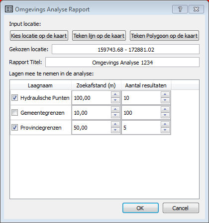
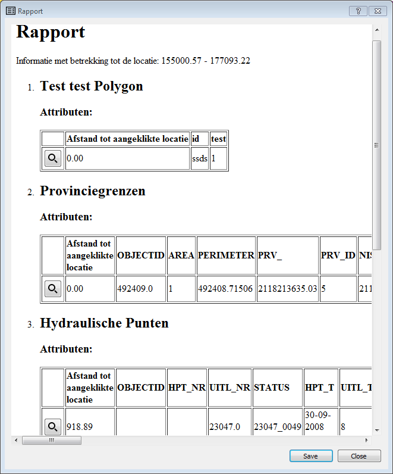

Omgevings analyse tool - rapporteertool voor milieuvergunningen
================================================================

Op vraag van LNE werdt een tool ontwikeld een omgevingsrapport van locatie maakt. 

Ten opzichte van de verschillende vector lagen, die ingeladen zijn in het project (WFS of vectorlaag) 
wordt een soort rapport gegenereerd wordt voor een specifieke locatie:

De gebruiker kan een locatie op de kaart aanklikken of een polygoon intekenen. 

De volgende informatie wordt weergegeven:
- Welke afstand de geslecteerde locatie tot de dichtsbijgelegen objecten van de verschillende vectorlagen gelegen zijn.
- Toon de attributen van dichstbijgelegen feature
- Knop bekijk op kaart /zoon naar in rapport.
- De dichtbijzijnde objecten worden geselecteerd zodat ze op de kaart in de attribuuttable terug te vinden zijn.
- Export van rapport naar een document dat in MS Word kan geopend worden.
- De ingestelde parameters per laag worden samen met et project opgeslagen en zijn dus opnieuw beschikbaar nadat het project werd afgesloten.  

Werking
-------
De rapporteertool kan ontwikkelt als een QGIS plugin, de configuratie kan een gewoon QGIS-project zijn. 
Veel gevraagde zaken zijn in principe gewoon standaard QGIS functionaliteit. 
Speficieke knoppen uitschakellen oof zichtbaar maken is mogelijk in QGIS.
De lagen die worden ingeladen kan worden opslagen in de in het QGIS-project (.qgs).

De focus van deze opdracht zal dus liggen op het ontwikkelen op de *genereer rapport* knop.
Deze knop wordt ontwikkeld als een soort omgevings analyse tool, die de meeste nabijzijnde objecten nabij van geometrie opzoekt. 

Deze ziet er momenteel zo uit:

Dit resulteerd in een volgende rapport, dat je kan opslaan als word of html-document:

