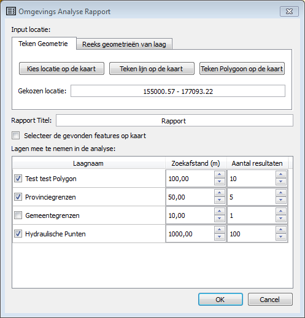

Omgevings analyse tool - rapporteertool voor milieuvergunningen
================================================================

Op vraag van LNE werdt een tool ontwikeld een omgevingsrapport van locatie maakt. 

Ten opzichte van de verschillende vector lagen, die ingeladen zijn in het project (WFS of vectorlaag) 
wordt een soort rapport gegenereerd wordt voor een specifieke locatie:

De gebruiker kan een locatie op de kaart aanklikken of een lijn of polygoon intekenen. 

De gebruiker kan ook een vectorlaag gebruiken als input, 
dan wordt er voor elke feature een appart rapport weggeschreven naar een output folder.  

De volgende informatie wordt weergegeven:
- Welke afstand de geslecteerde locatie tot de dichtsbijgelegen objecten van de verschillende vectorlagen gelegen zijn.
- Toon de attributen van dichstbijgelegen features
- Knop bekijk op kaart /zoon naar in rapport
- De gevonden objecten kunnen worden geselecteerd als je "Selecteer de gevonden features" aanvinkt, zodat ze op de kaart in de attribuuttabel terug te vinden zijn.
- Export van rapport naar een document dat in MS Word kan geopend worden.
- De ingestelde parameters per laag worden samen met et project opgeslagen en zijn dus opnieuw beschikbaar nadat het project werd afgesloten.  

Werking
-------
De rapporteertool is ontwikkelt als een QGIS plugin, de configuratie is een gewoon QGIS-project. 
De instellingen worden mee opgeslagen in een het QGIS-project (.qgs) zodat je deze niet staads opnieuw moet instellen.

Het invoer formulier uit:

Dit resulteerd in een volgende rapport, dat je kan opslaan als word of html-document:

